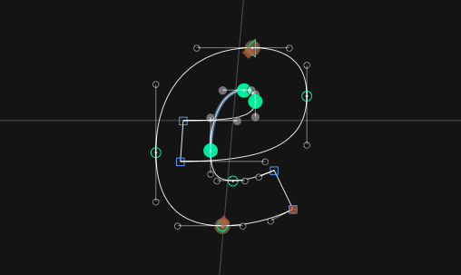

# Show Center Lines

This is a plugin for the [Glyphs font editor](http://glyphsapp.com/). After installation, it will add the menu item *View > Show Center Lines* (de: *Mittellinien azeigen,* es: *Mostrar lineas centrales,* fr: *Afficher lignes centrales*). You can set a keyboard shortcut in System Preferences. The plug-in will display a crosshair in the middle of the current selection:

It respects the italic angle and is Dark Mode compatible.

Via the context menu, you can add the current center lines as (blue) local guides.

### Installation

1. One-click install *Show Center Lines* from *Window > Plugin Manager*
2. Restart Glyphs.

### Usage Instructions

1. Open at least one glyph in Edit View.
2. Use *View > Show Center Lines* to toggle the display of the center lines.

### Changelog

**2.0.7:** Fixed a repeating exception when a corner component (or cap, brush or segment component) was part of the selection in Glyphs 4. Corner components have no coordinates of their own, and Glyphs 4 exposes them in the selection in a shape the plug-in did not expect, which made `layer.selectionBounds` throw on every redraw. Corner-like components are now skipped, the center is measured from the remaining selection, and anything that still goes wrong is logged to the Macro Window once instead of raising an alert on every redraw.

### License

Copyright 2019 Rainer Erich Scheichelbauer (@mekkablue).
Based on sample code by Georg Seifert (@schriftgestalt) and Jan Gerner (@yanone).

Licensed under the Apache License, Version 2.0 (the "License");
you may not use this file except in compliance with the License.
You may obtain a copy of the License at

http://www.apache.org/licenses/LICENSE-2.0

See the License file included in this repository for further details.
